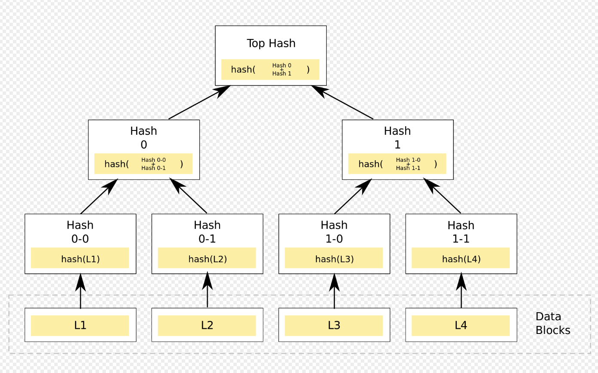
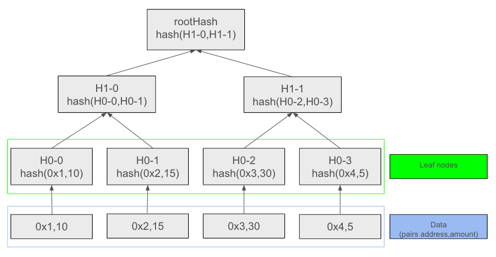
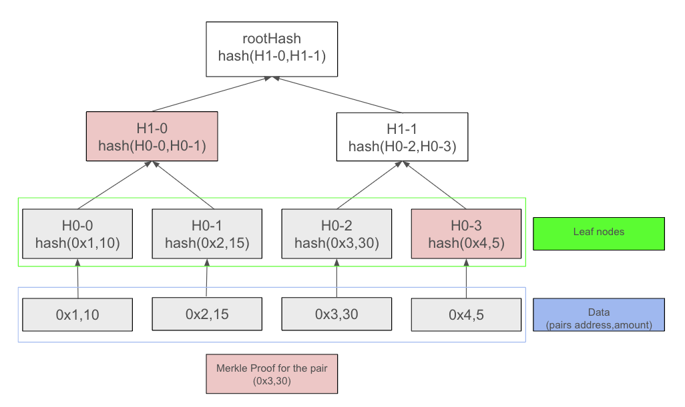

# Linea interview assignment: Merkle trees

## What is a Merkle tree ?

A Merkle tree is a binary tree where each leaf node contains a hash of a data block, and each non-leaf node contains a hash of its child nodes. This hierarchical hashing allows for quick and reliable verification of any data block within the tree by checking only a small subset of the hashes, known as a Merkle proof.
This allows a range of use cases, especially in blockchains where it is used to verify transactions.



## Use case example: Claimable airdrop

One of the most well-known use cases for Merkle Trees in the crypto space is claimable airdrops. When a protocol wants to airdrop claimable tokens to its user base, it needs to create a smart contract that users can call to claim their share of the airdrop. The issue with this approach is that if there are many addresses, it would require storing a large amount of data on-chain. Specifically, this means storing the pairs [address, amount] for each eligible address, and verifying this data would be costly as it would need to iterate through all the addresses every time the claim function is called.

This is where Merkle Trees can be used more efficiently to verify the amount of tokens a user can claim. Thanks to the Merkle proof, the verification process only needs to iterate through the path in the tree corresponding to the pair [address, amount] of the claimant.

**Airdrop Merkle tree**



Each leaf node hash is computed from a pair [address, amount], and each non-leaf node hash is computed from the hashes of two child nodes.

**Airdrop Merkle proof**

As an example, we want to verify that address 0x3 can claim 30 tokens. To build the Merkle proof, we only need to take the path from its leaf node to the Merkle root hash, which gives us:



As we can see, only a small portion of the tree is needed to verify that a pair is part of the tree. Additionally, for the smart contract that will be used to verify the data, we only need to store the root hash and pass the proof each time we want to verify the data, making it very efficient.

### Implementation of the example

An implementation has been added to this repository to demonstrate this specific use case of claimable airdrops.
The solidity contract in charge of the verification can be found in [./contracts/ClaimableAirdrop.sol](./contracts/ClaimableAirdrop.sol), the MerkleTree implementation has been done in typescript and can be found in [./test/lib/Merkle.ts](./test/lib/Merkle.ts)

To start testing it run:

```bash
npm i
npm hardhat test
```
